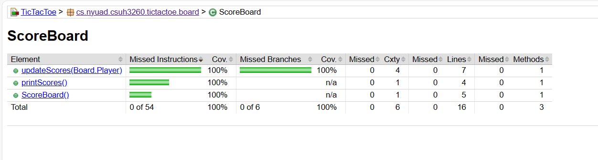

[](https://classroom.github.com/a/ozKW19sS)
# tictactoe

A simple tictactoe implementation to be used as a basis for CS UH-3260 assignments on collaborative software development.

Group name: Group 8  
Group members:
  1. Zulfkhar Maukeuy (zzm213)
  2. Ramsha Bilal (rb4919)
  3. Tuqa Abdelnasir (ua2017)

## Instructions
### Prerequisites
1. Java Development Kit (JDK) installed on your machine.
2. Maven

### Compilation & Running
1. Navigate to the root directory of this project where the pom.xml file is located:
```
cd path/to/your/project/root
```
2. Compile your project using Maven:
```
mvn clean compile
```
3. Run the program using the following command:
```
mvn exec:java -Dexec.mainClass="cs.nyuad.csuh3260.tictactoe.TicTacToeGame"
```
# Unit Testing
**8 methods** are created to test the Scoreboard class. The testing framework, code coverage tool, and test selection techniques are stated below.

## Testing Framework Used
We used JUnit 5 as our testing framework to write and run unit tests for the Tic Tac Toe game.

## Code Coverage Tool
For measuring code coverage, we used JaCoCo. To generate a code coverage report, follow these steps:
1. Run the following command in the project directory:

```console
mvn clean test
```
2. After the build is successful, navigate to the `target/site/jacoco` directory.
3. Open the `index.html` file in a web browser to view the code coverage report.

## Test Selection Techniques for ScoreBoard Class
We employed a combination of techniques to ensure comprehensive test coverage:

### Boundary Value Analysis
- `testInitialScores`: This test ensures that the initial scores are correctly initialized to zero, covering the boundary case of minimum scores.

### Equivalence Classes
- `testUpdateScores_XWins`: Tests the behavior when X wins a game, representing the equivalence class of X winning.
- `testUpdateScores_OWins`: Tests the behavior when O wins a game, representing the equivalence class of O winning.
- `testUpdateScores_Tie`: Tests the behavior when the game ends in a tie, representing the equivalence class of a tie game.

### Scenario Testing
- `testUpdateScores_MultipleGames`: Simulates multiple games to test the behavior of the scoreboard.
In the `testUpdateScores_MultipleGames` method, several scenarios are tested to ensure the scoreboard behaves correctly in different situations. These scenarios include:
1. **X Wins**: Simulates a scenario where Player X wins a game.
2. **Tie Game**: Simulates a scenario where the game ends in a tie.
3. **O Wins**: Simulates a scenario where Player O wins a game.
4. **Multiple Games**: Simulates a sequence of multiple games with alternating winners and ties to test the overall functionality of the scoreboard across multiple iterations.

### Edge Cases
- `testUpdateScoresWithNullMultipleTimes`: Tests the behavior when the `updateScores` method is called multiple times with null, ensuring that ties are correctly incremented even in edge cases.
- `testUpdateScores_InvalidPlayer`: Tests the behavior when an invalid player (NONE) is passed to the `updateScores` method, covering the edge case of invalid input.

### Mocking
- `testPrintScores`: Utilizes mocking with Mockito to verify that the correct output is printed when calling the `printScores` method, ensuring proper functionality without relying on actual standard output.

These tests collectively ensure comprehensive coverage of the ScoreBoard class, covering various scenarios and edge cases to validate its correctness and robustness. 100% statement and branch coverage achieved for the scoreboard class.


